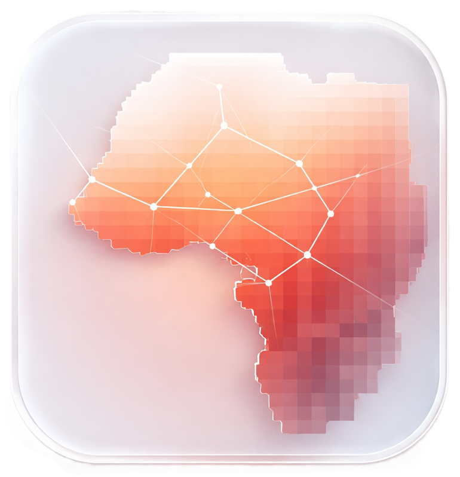
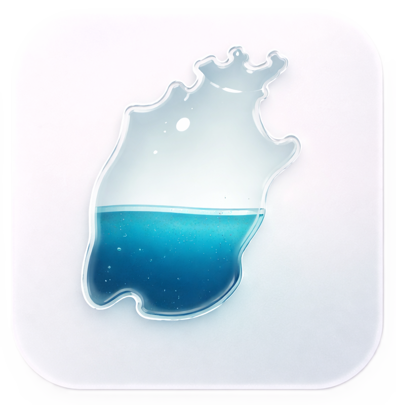

<!-- Hero Card -->
<section class="hero-card">
    

        <h1>Ankhbayar Delgerchuluun</h1>
        
Development Economist & Data Scientist

        

            Research Manager at the Center for Evaluation and Development (C4ED), Mannheim, Germany. Focused on rigorous impact evaluation across developing countries, integrating RCT and quasi-experimental methods with large-scale primary data systems and quality assurance. Applies advanced geospatial analytics to measure and model environmental and socioeconomic dynamics. Committed to strengthening evidence-based decision-making through applied econometrics, data science, and analytical frameworks.
        

        

            <a href="/cv" class="cta-button">
                <i class="fas fa-file-alt"></i> View CV
            </a>
            <a href="https://www.linkedin.com/in/ankhbayar-delgerchuluun-b94272197/" class="cta-button secondary">
                <i class="fab fa-linkedin fa-lg"></i> Connect
            </a>
        

    

    

        
    

</section>

<!-- Featured Projects Section -->

    <h2 class="section-title">Featured Work</h2>

    <!-- Environmental Geospatial Analysis -->
    

        

            
        

        <h3 class="project-title">Up in the Air: Air Pollution & Conflict</h3>
        

            
                <i class="fas fa-satellite"></i> Geospatial Analysis
            
            
                <i class="fas fa-code"></i> R & STATA
            
            
                <i class="fas fa-cube"></i> Instrumental Variable
            
            
                <i class="fas fa-microscope"></i> Remote sensing
            
        

        

            Master’s Thesis: Causal analysis examining the relationship between environmental degradation and social stability in West Africa. Employed an instrumental variable strategy with large-scale geospatial data to identify the impact of air pollution on conflict dynamics. Supervised by Prof. Dr. Krisztina Kis-Katos and Dr. Kerstin Unfried.
        

        <a href="https://github.com/ankhaa0813/air_pollution_conflict" class="cta-button accent-pink">
            <i class="fas fa-external-link-alt"></i> View Project
        </a>
    

    <!-- Impact Evaluation & Development Research -->
    

        

            
        

        <h3 class="project-title">Aral Sea Monitoring Dashboard</h3>
        

            
                <i class="fas fa-chart-bar"></i> Data Analytics
            
            
                <i class="fas fa-code"></i> Shiny Apps
            
            
                <i class="fas fa-map"></i> Mapping
            
            
                <i class="fas fa-microscope"></i> Remote sensing
            
        

        

                Aral Sea Project: Interactive data visualization platform examining the long-term transformation of the Aral Sea. Integrates satellite imagery, spatial datasets, and time-series climate indicators to illustrate environmental change and its socioeconomic context in Central Asia, developed using advanced R/Shiny and geospatial analytics.
        

        <a href="https://ankhaa0813-aral-sea-demo.hf.space/" class="cta-button accent-pink">
            <i class="fas fa-folder-open"></i> View Project
        </a>
    

<!-- CTA Section -->
<section class="glass-card text-center" style="margin-top: 3rem;">
    <h3>Want to explore more?</h3>
    
Check out my complete GitHub profile for additional projects and contributions.

    <a href="https://github.com/ankhaa0813" class="cta-button">
        <i class="fab fa-github"></i> Visit GitHub
    </a>
</section>